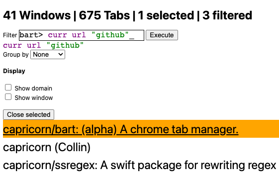

# bart

`bart` is a chrome extension for managing browser tabs. It consists of a UI and a query language.



## Install

- In chrome, navigate to [chrome://extensions/](chrome://extensions/).
- Enable 'Developer Mode' in the top-right corner.

Next, in a terminal:

```bash
$ git clone 'git@github.com:capricorn/bart.git'
$ cd bart
$ npm install
$ npm run build
```

- Switch back to [chrome://extensions](chrome://extensions). 
- Click 'Load unpacked' in the top-left corner.
- Select the `bart/dist` directory. 

`bart` is now accessible from the 'Extensions' chrome toolbar button.

## bart query language

### Empty query

If no query is present, every tab is filtered.

### Filters

If a query is not empty it must contain at least one filter.
A filter is a predicate applied to some field of a tab, e.g. title.

Example: filtering all tabs for `google.com`:

```
url "google.com"
```

N.B. Filters that operate on tab string fields (e.g. `title`) filter with `String.contains`.  
N.B. String comparison is case insensitive; strings are made lowercase before comparison.

#### Available filters

```
// Filter tabs with url containing the string arg
url "url_to_match"
// Filter tabs with title containing the string arg
title "title_to_match"
// Filter tabs to the current window
curr
// Filter tabs to tabs selected in UI
$
```

### Filter composition

Filters can be composed with the 'combinators' in the set `{|, &}`.
If two filters are written consecutively without an explicit combinator
composition is implicitly `&`, i.e. `f1 f2 == & f1 f2`.

Example: filtering tabs for Stack Exchange with iOS in the title:

```
url "stackoverflow.com" title "iOS"
```

Example: filtering the prior query OR a tab of `developer.apple.com`:

```
| url "developer.apple.com" & url "stackoverflow.com" title "iOS"
```

### String arguments 

Strings are specified in double quotes, e.g. "hello world". They currently
do _not_ support escapes.

Like filters, strings can be composed with the combinators in the
set `{!, &, |}`. Likewise, if a sequence of strings has no combinator specified
`&` is implicitly assumed.

The idea with string combinators is that a predicate can be applied
over them. For instance, given a predicate `f:string->bool`,
a map `F:(f:string->bool, StringCombinator)->bool` can apply `f` like so:

`F(f, | "abc" & "xyz" "ijk") = f("abc") || (f("xyz") && f("ijk"))`

These string combinators are passed to filters as arguments.

## EBNF

```ebnf
Command = "." | "bm";
Combinator = "&" | "|";
FilterName = "url" | "title" | "curr";

StringCombinator 
= string
| [(Combinator | "!")], StringCombinator, {StringCombinator};

Filter = FilterName, StringCombinator;
FilterCombinator = [Combinator], Filter, {Filter}, [FilterCombinator];

Root = [Command], [FilterCombinator];
```